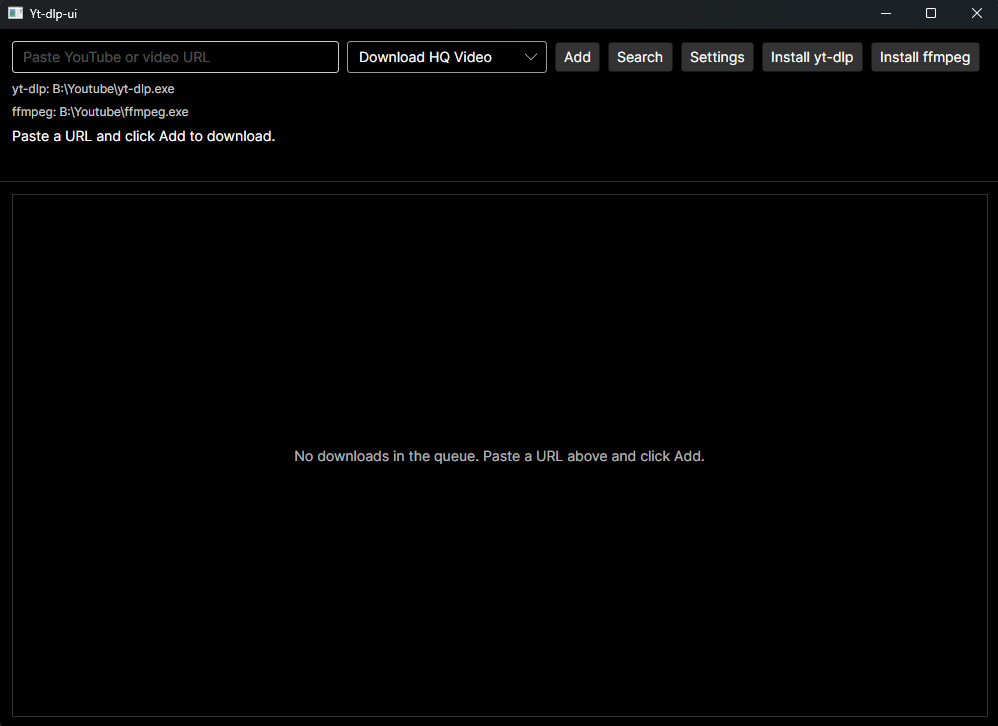

# Yt-dlp-ui

Desktop UI for [yt-dlp](https://github.com/yt-dlp/yt-dlp): a download queue, profile-based settings, and optional yt-dlp/ffmpeg setup—without living on the command line.



## Features

- **Download queue** — paste URLs, track status and progress, cancel or remove jobs
- **URL cleanup** — strips common tracking query parameters from pasted YouTube links
- **Download folder** — choose on first launch; change anytime in settings
- **Profiles** — named yt-dlp option sets with a built-in option catalog, CLI preview, and quote-aware extra arguments
- **Built-in profiles** — Default (single MP4), Download Audio as mp3, Download HQ Video (see below)
- **Binaries** — set or browse yt-dlp/ffmpeg paths, test each, or install from the main window
- **Settings** — tabbed editors for common yt-dlp flags (subs, metadata, SponsorBlock, and more)
- **Job logs** — view yt-dlp output for failed (or finished) jobs

## Built-in profiles

Created under `~/.yt-dlp-ui/profiles/` on first run (missing profiles are added without overwriting existing ones):

| Profile | Purpose |
|---------|---------|
| **Default** | Single MP4 when available, otherwise best merged video+audio |
| **Download Audio as mp3** | Best audio → MP3, SponsorBlock, parallel fragments |
| **Download HQ Video** | Up to 1080p H.264/AAC as one `.mp4` file |

Pick the active profile in **Settings → Profiles**. Details: [docs/settings.md](docs/settings.md).

## Getting started (users)

1. Build or download a self-contained app (see [Build](#build-and-test) below).
2. On first launch, choose a download folder.
3. Install or point to **yt-dlp** and **ffmpeg** (main window or **Settings → Binaries**).
4. Paste a URL, add to the queue, and start downloads.

Config and profiles live in `~/.yt-dlp-ui/` (`app.json`, `profiles/*.json`).

## Build and test

Requires **Docker** for default `make` targets (dev container), **or** .NET 8 SDK on the host with `IN_CONTAINER=1`.

```bash
make ci              # restore, Release build, tests
make coverage        # tests + HTML report in artifacts/coverage/html/
make publish-ui-win  # Windows x64 → artifacts/publish-ui-win-x64/YtDlpUi.exe
make publish-ui      # host RID → artifacts/publish-ui-<RID>/YtDlpUi
```

`make build-release` compiles Release assemblies only; use **`make publish-ui`** (or `publish-ui-win`) for a runnable app.

Host SDK without container:

```bash
IN_CONTAINER=1 make ci
IN_CONTAINER=1 make publish-ui RID=linux-x64
```

More: [docs/build.md](docs/build.md).

## Project structure

```
YtDlpUi.slnx
├── src/
│   ├── YtDlpUi.Core/       Queue, yt-dlp invocation, profiles, config, installers
│   └── YtDlpUi.UI/         Avalonia desktop UI
└── tests/
    ├── YtDlpUi.Core.Tests/
    └── YtDlpUi.UI.Tests/
```

## Documentation

- [docs/build.md](docs/build.md) — solution layout, coverage gates, publish options
- [docs/settings.md](docs/settings.md) — config paths, binaries, download folder, profiles, security

## Legal

You must comply with the terms of service of content providers and applicable law. This project is an unofficial front-end for yt-dlp; the authors are not affiliated with YouTube or Google.

## License

See [LICENSE](LICENSE).
